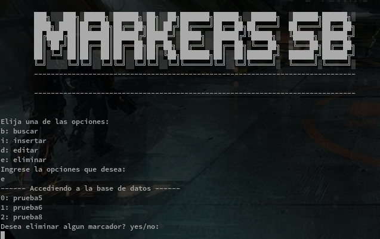

# manage_markers
***
## Tiene dos opciones para poder ejecutar. Una de ellas mediante linea de 
## Comandos y la otra una interfaz de escritorio.
***
Script para marcadores web. (Guardar accesos)

Para realiar la instalacion inicial de la base de datos 
1_ Tener instalado Python3

2_ Ejecutar el archivo "loadsSettings.py" dentro de la carpeta
packages

>>> python3 loadsSettings.py

Esto cargara la configuracion inicial.

***
### Linea de comandos 
***
Podra acceder desde el terminal para poder administrar y ver
las contraseñas.

b - Desde esta opcion podra realizar una busqueda en la base de
datos las contraseñas que tenga almacenada. 

i - Desde esta opcion podras agregar nuevas contraseñas.

d - Desde esta opcion podras editar las contraseñas ya cargadas.

e - Desde esta opcion podras eliminar las contraseñas que 
ya no uses.

